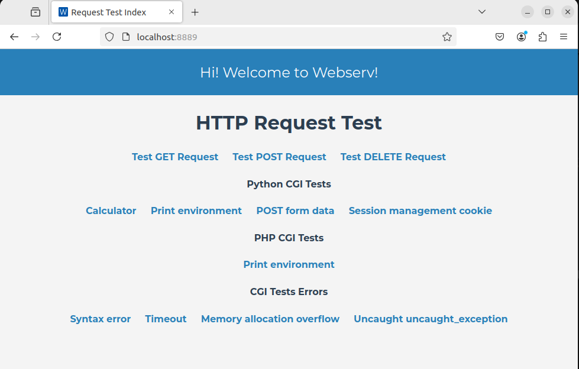

# 🌐 Webserv

**Webserv** is a custom HTTP web server written in C++98, inspired by [**NGINX**](https://nginx.org/en/) and is designed to handle HTTP requests using efficient I/O multiplexing, supporting core HTTP methods and a range of directives to configure server behavior. This project aims to deepen the understanding of HTTP protocol, socket programming, and asynchronous I/O handling. It demonstrates a simple yet functional server with the capability to serve static and dynamic content via custom CGI.

## ✨ Features

- **HTTP/1.1 Compliance**: Supports essential HTTP methods - `GET`, `POST`, and `DELETE`.
- **Configurable Server Settings**: Accepts configuration files that define server behavior and directives, allowing flexible setup.
- **Custom CGI Support**: Enables dynamic content handling using custom CGI scripts.
- **Efficient I/O Multiplexing**: Built with `epoll` for handling multiple connections concurrently with minimal overhead.
  
### 🛠 Supported Configuration Directives

- **Contexts**:
  - **server**: Defines a server block.
  - **location**: Defines a location block within a server.

- **Directives**:
  - **listen**: Specifies the address and port the server listens on.
  - **server_name**: Defines the name of the virtual server.
  - **error_page**: Sets custom error pages.
  - **client_max_body_size**: Specifies the maximum client request body size.
  - **root**: Sets the root directory for a specific context.
  - **limit_except**: Limits allowed HTTP methods within a context.
  - **index**: Specifies the default index file for a directory.
  - **autoindex**: Enables or disables directory listing.
  - **return**: Sends HTTP redirection responses.
  - **upload_store**: Defines the directory for file uploads.
  - **cgi_ext**: Specifies file extensions that should be processed by CGI scripts.

## 🚀 Usage

### Prerequisites

- **C++ Compiler**: Compatible with C++98 standard.
- **Linux OS**: Uses `epoll`, which is Linux-specific.

### Running the Server
First, compile using `make`. Then, to start the server, provide a configuration file as an argument. This file should define your server settings, such as listen port, root directory, and any CGI handling.
```bash
./webserv path/to/config.conf
```
### Configuration Example
Below is an example of a simple configuration file:
```nginx
server {
    listen 8080;
    server_name example.com;

    root /var/www/html;
    index index.html;

    error_page 404 /404.html;

    location / {
        autoindex on;
    }

    location /uploads/ {
        upload_store /var/www/uploads;
    }

    location /cgi-bin/ {
        cgi_ext .cgi;
    }

    client_max_body_size 8M;
    limit_except GET POST DELETE;
}
```

## 🔍 Testing
To test the server, run it and then use curl or Firefox (optimized for this browser). Example `curl` requests:
```bash
# GET request
curl http://localhost:8080/

# POST request
curl -X POST http://localhost:8080/upload -F "file=@<path/to/file>"

# DELETE request
curl -X DELETE http://localhost:8080/file.txt
```
To test with your browser just type `http://localhost:8080/` on the top search bar.
Errors and logs will be printed to the console by default.
**Note:** Make sure you update the root directive in the configuration file with the path to the resources directory.

## 👥 Contributors

This project was developed collaboratively as part of the 42 School curriculum.

- [damachad](https://github.com/damachad)
- [mde-sa--](https://github.com/miguelsrmv)
- [tiaferna](https://github.com/TiagoMartins14)

## 📝 Documentation 
You can find my notes for this project [here](https://spicy-dirigible-2b6.notion.site/Webserver-2b27a84f4c5841dd80fb25229912e953?pvs=4).

## Demo



[webserv_demo.webm](https://github.com/user-attachments/assets/a17c65eb-5b1a-4c57-8907-6e4edffd2f83)


